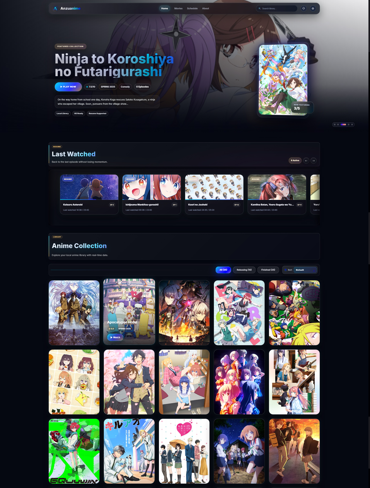
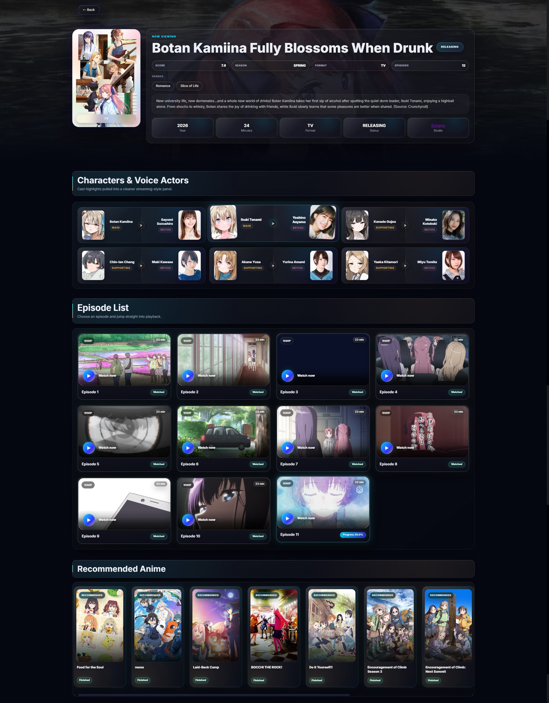
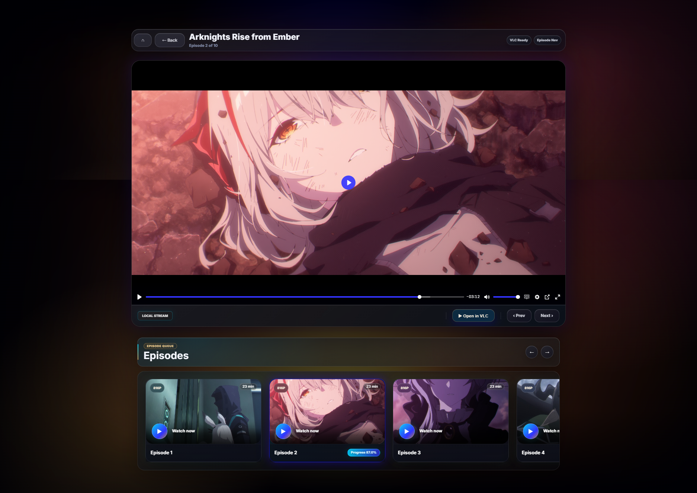

# Anzuanime Server

Local anime library and streaming server built with Flask.

## Screenshots

### Home


### Anime Detail


### Player

## Features

* Local anime and movie library
* AniList metadata integration
* Anime detail pages with poster, banner, genres, characters, studio, recommendations, and relations
* Continue Watching progress
* Episode player with subtitle support
* Auto next episode
* Resume playback position
* VLC integration
* Discord Rich Presence
* Studio profile and studio project catalog
* Anime schedule page
* Theme presets:

  * Dark Blue
  * Midnight Violet
  * Dark Orange
  * AMOLED Black

## Requirements

* Python 3.10 or newer
* FFmpeg and FFprobe available in PATH
* Internet connection for AniList metadata
* Optional: VLC Media Player
* Optional: Discord desktop app for Rich Presence

## Installation

Clone this repository:

```bash
git clone https://github.com/anzutm/anzuanime-server.git
cd anzuanime-server
```

Create a virtual environment:

```bash
python -m venv .venv
```

Activate it on Windows PowerShell:

```powershell
.venv\Scripts\Activate.ps1
```

Install dependencies:

```bash
pip install -r requirements.txt
```

Run the application:

```bash
python app.py
```

Open this address in your browser:

```text
http://127.0.0.1:5000
```

## First Setup

Open the Settings page in the application and configure:

* Watchlist folder
* Ongoing folder
* Movies folder
* VLC executable path, optional
* Discord Rich Presence, optional
* Theme preset

Your anime and movie files are not included in this repository.

## Notes

This project is intended for personal local-library use.

Do not expose the Flask development server directly to the public internet.
